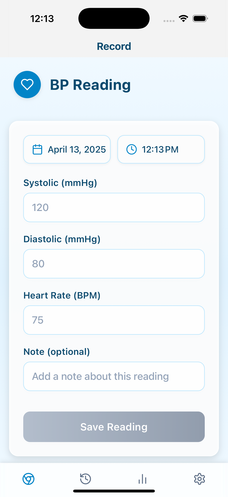
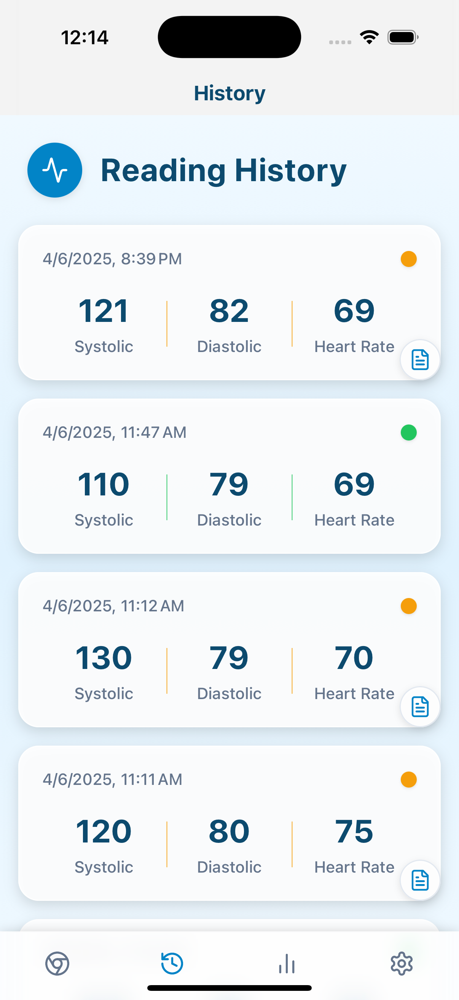
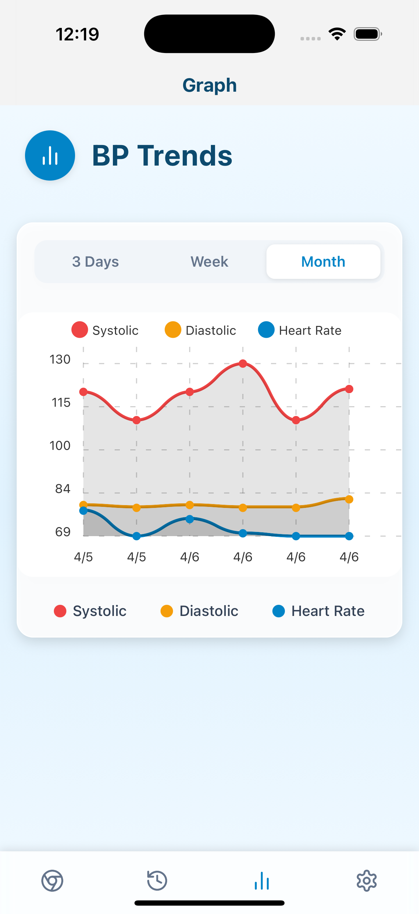
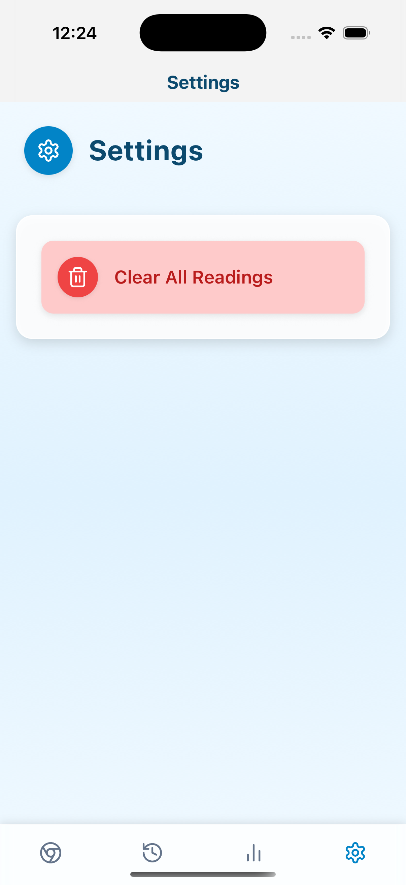

NOTE: this was built almost entirely by Cline (with Claude 3.7 Sonnet). I also used bolt.new to create the very first bare-bones skeleton of the app. The intent was to test Cline's agentic capabilities. Conclusion: they are quite impressive! "Meesa likes!"

# Blood Pressure Tracker

A mobile application for tracking and visualizing blood pressure readings over time. Built with React Native and Expo.

## Features

- **Record Blood Pressure Readings**: Easily input systolic, diastolic, and heart rate values with date and time
- **View Reading History**: See all your past readings with color-coded status indicators
- **Visualize Trends**: Track your blood pressure trends over time with graphs
- **Edit and Annotate**: Add notes to readings and edit past entries
- **Data Persistence**: All readings are stored locally on your device
- **Platforms Supported**: iOS, Android, Web

## Screenshots


### Record Screen
*Screenshot showing the main recording interface where users can input blood pressure values*



### History Screen
*Screenshot showing the history view with color-coded readings*



### Graph Screen
*Screenshot showing the trend visualization with the line chart*




### Settings Screen
*Screenshot showing the settings interface*



## Developer Guide

### Prerequisites

- [Node.js](https://nodejs.org/) (v14 or newer)
- [npm](https://www.npmjs.com/) or [Yarn](https://yarnpkg.com/)
- [Expo CLI](https://docs.expo.dev/workflow/expo-cli/)

### Setup and Running Locally

1. **Clone the repository**

   ```bash
   git clone https://github.com/yourusername/blood-pressure-tracker.git
   cd blood-pressure-tracker
   ```

2. **Install dependencies**

   ```bash
   npm install
   # or
   yarn install
   ```

3. **Start the development server**

   ```bash
   npm run dev
   # or
   yarn dev
   ```

4. **Running on a device or emulator**

   - Install the Expo Go app on your iOS or Android device
   - Scan the QR code from the terminal with your device
   - Alternatively, press 'a' to open on an Android emulator or 'i' for iOS simulator

### Project Structure

- `app/` - Main application code
  - `(tabs)/` - Tab-based navigation screens
    - `index.tsx` - Record screen (main screen)
    - `history.tsx` - History of readings
    - `graph.tsx` - Visualization of blood pressure trends
    - `settings.tsx` - App settings
  - `_layout.tsx` - Navigation layout configuration
- `assets/` - Images and other static assets
- `hooks/` - Custom React hooks

### Building for Production

To create a production build:

```bash
# For web
npm run build:web
# or
yarn build:web

# For iOS/Android
expo build:ios
expo build:android
```

## Technologies Used

- [React Native](https://reactnative.dev/)
- [Expo](https://expo.dev/)
- [React Navigation](https://reactnavigation.org/)
- [AsyncStorage](https://react-native-async-storage.github.io/async-storage/)
- [react-native-chart-kit](https://github.com/indiespirit/react-native-chart-kit)
- [Lucide Icons](https://lucide.dev/)
- [Expo Linear Gradient](https://docs.expo.dev/versions/latest/sdk/linear-gradient/)

## License

This project is licensed under the MIT License - see the LICENSE file for details.
